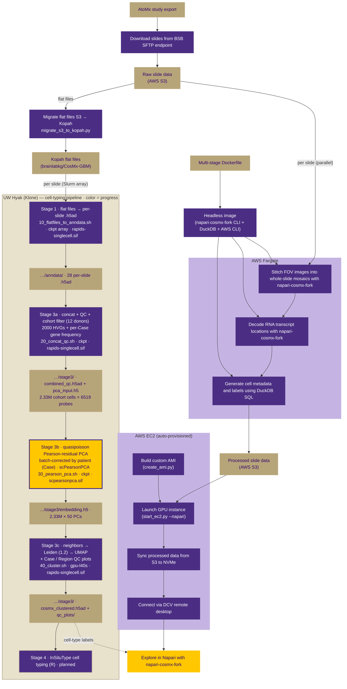

# cosmx-utilities

A scalable, end-to-end pipeline for processing [CosMx Spatial Molecular Imager](https://brukerspatialbiology.com/products/cosmx-spatial-molecular-imager/single-cell-imaging-overview/) data from the [BRaIN Lab](https://dlmp.uw.edu/research-labs/brainlab) at the University of Washington. 

This pipeline automates the workflow for converting raw CosMx slide exports to interactive spatial visualization in [Napari](https://napari.org), using AWS cloud infrastructure for on-demand, cost-effective compute and a fork of [napari-cosmx](https://nanostring-biostats.github.io/CosMx-Analysis-Scratch-Space/posts/napari-cosmx-intro/) for headless image processing and data exploration.

## Pipeline overview

After exporting a study from the AtoMx Spatial Informatics Platform, raw slide data is staged on AWS S3. Each slide is processed in parallel on AWS Fargate: FOV images are stitched into whole-slide mosaics, RNA transcript locations are decoded, and cell metadata is generated, all formatted for viewing in Napari. Processed data is uploaded back to S3, where it can be loaded into Napari for visualization across slides.



**Progress legend (Hyak cell-typing pipeline):** solid purple = done · yellow = running now · dashed border = not yet run / planned · gold = data artifact on Kopah. Batch correction is at the patient (`Case`) level; tissue regions (tumor bulk / infiltrating edge / contralateral) are preserved as biological signal.

## Key design decisions

**Ephemeral Fargate compute** — Using Fargate's ephemeral storage rather than manually provisioning EC2 instances and EBS volumes for each study avoids the accumulation of long-lived AWS resources that are common with ad hoc processing workflows and costly to maintain.

**DuckDB for metadata streaming** — Cell metadata is streamed from S3 with DuckDB SQL queries and transformed into Napari metadata layers, enabling interactive overlay of cell annotations without storing large metadata files locally.

## Repository structure

```
cosmx-utilities/
├── napari-cosmx-fork/       # Fork of napari-cosmx with optional GUI dependencies
├── scripts/
│   ├── process-slide.py     # Single slide: detect segmentation version, download, stitch, upload
│   ├── process-slides.py    # Discover all slides in S3 and launch Fargate tasks
│   └── generate-slide-metadata.py  # Generate _metadata.csv with cell metadata and deterministic colors
├── fargate/                 # Fargate task definitions and IAM configuration
├── ec2/                     # EC2 auto-provisioning for analytics and Napari viewer instances
│   ├── start_ec2.py         # Launch analytics (r5a) or Napari (g4dn GPU) instances
│   ├── create_ami.py        # Build custom AMI with all dependencies pre-installed
│   └── ami_setup.sh         # User-data setup script (deps, volumes, DCV)
├── Dockerfile               # Multi-stage: headless (Fargate) and GUI (desktop) targets
└── pyproject.toml           # uv workspace with optional [gui] extra
```

## Quick start

### Local development

```bash
# Install CLI tools (no GUI required)
uv sync
uv run stitch-images --help
uv run read-targets --help

# Install with Napari GUI for interactive visualization
uv sync --extra gui
uv run napari /path/to/processed-output
```

### Processing slides on Fargate

Discover all slides under an S3 experiment directory and launch one Fargate task per slide:

```bash
# Preview what would be launched
uv run python scripts/process-slides.py s3://bucket/project/study/ --whatif

# Launch Fargate tasks (one per slide, parallel)
uv run python scripts/process-slides.py s3://bucket/project/study/

# Skip already processed slides
uv run python scripts/process-slides.py s3://bucket/project/study/ --skip
```

Each Fargate task runs `process-slide.py`, which:
1. Queries segmentation manifests in S3 via DuckDB to find the correct segmentation version
2. Downloads only the needed CellLabels, morphology images, and AnalysisResults
3. Stitches FOV images into whole-slide zarr mosaics (`stitch-images`)
4. Decodes RNA transcript locations (`read-targets`)
5. Generates `_metadata.csv` with metadata annotations such as cell type and assigns deterministic colors
6. Uploads processed results back to S3

### Docker images

The multi-stage Dockerfile produces two image variants:

```bash
# Headless: CLI tools + AWS CLI for Fargate batch processing
docker build --target headless -t cosmx-utilities:headless .

# GUI: Full Napari with Qt for interactive visualization
docker build --target gui -t cosmx-utilities:gui .
```

## Viewing processed slides on your own server

If you've received a processed CosMx dataset and want to run Napari locally instead of on the AWS-provisioned EC2 instance, the stitched output is self-contained — there are no AWS dependencies at view time.

**1. Copy the processed data from S3.**

Each slide directory contains `images/` (zarr pyramid), `_metadata.csv`, and `targets.hdf5`. Budget ~50–100 GB per slide; a full study can run several hundred GB. SSD storage is strongly recommended — spinning disks make tile loading painful.

```bash
aws s3 sync s3://<bucket>/napari-stitched/<study>/<experiment>/ /path/to/local/stitched/
# or, if rclone is configured:
rclone sync :s3:<bucket>/napari-stitched/<study>/<experiment>/ /path/to/local/stitched/ \
    --transfers 32 --checkers 16 --progress
```

You'll need AWS credentials with read access to the data bucket — ask the data owner.

**2. Install system dependencies (Linux headless server).**

PyQt6 needs Qt platform libraries that aren't installed by default on bare servers. On Ubuntu/Debian:

```bash
sudo apt install -y libxcb-cursor0 libxkbcommon-x11-0 libegl1 libgl1 libdbus-1-3 \
    libxcb-icccm4 libxcb-image0 libxcb-keysyms1 libxcb-randr0 libxcb-render-util0 \
    libxcb-shape0 libxcb-xinerama0 libxcb-xkb1
```

Napari needs a graphical session. If your server is headless, use VNC, X-forwarding, or NICE DCV. A discrete GPU isn't required — software OpenGL (Mesa) works, just slower on large mosaics.

**3. Clone this repo and install with the GUI extra.**

The `napari-cosmx-fork` is a uv workspace member of this repo, and the top-level wrapper adds dependencies (dask, polars, matplotlib) that the Napari load path uses. Don't install the fork standalone.

```bash
# Install uv if needed: https://docs.astral.sh/uv/getting-started/installation/
git clone https://github.com/UW-BRaIN-lab/cosmx-utilities.git
cd cosmx-utilities
uv sync --extra gui
```

`uv` will provision a Python 3.10 interpreter automatically — the fork pins `>=3.8,<3.11`, so a system `python3.12` won't satisfy it directly.

**4. Launch Napari.**

```bash
uv run napari /path/to/local/stitched
```

**Resource notes.** Loading a stitched slide pulls the zarr pyramid and `targets.hdf5` into memory lazily, but interactive panning at high zoom is RAM-hungry. Plan for at least 64 GB free RAM; 128 GB is comfortable for the typical CosMx slide.

## Infrastructure setup

Fargate task definitions, IAM roles, and networking configuration are documented in [`fargate/FARGATE-SETUP.md`](./fargate/FARGATE-SETUP.md). Infrastructure IDs are stored in `fargate/.env` (gitignored) — copy `fargate/.env.example` to get started.

## Hyak cell-typing pipeline (in progress)

We are extending the pipeline onto the University of Washington's Hyak HPC cluster ([Klone](https://hyak.uw.edu/docs/)) for GPU-accelerated cell typing and batch correction, scheduled with [Slurm](https://slurm.schedmd.com/overview.html) and run from [Apptainer](https://apptainer.org/docs/user/main/) images (converted from the Docker build), with working storage on UW Kopah. The stages live in [`pipeline/`](./pipeline) and are shown in the diagram above:

- **Stage 1** converts each slide's CosMx flat files into an AnnData `.h5ad`.
- **Stage 3a** concatenates the cohort, applies per-cell QC, restricts to the study donors, and selects highly variable genes.
- **Stage 3b** computes a patient-level, batch-corrected quasi-Poisson Pearson-residual PCA with [scPearsonPCA](https://nanostring-biostats.github.io/CosMx-Analysis-Scratch-Space/posts/pearsonpca/), following the Bruker CosMx analysis vignette (the SVD is taken over the genes × genes cross-product, so the dense residual matrix is never formed).
- **Stage 3c** builds the neighbor graph, Leiden clustering, and UMAP on the GPU with [rapids-singlecell](https://rapids-singlecell.readthedocs.io/) (`gpu-l40s` partition), and emits UMAP QC plots for reviewing the batch correction.

Still planned: InSituType cell typing (Stage 4, R), [scvi-tools](https://scvi-tools.org) integration, and interactive Napari sessions via [Open OnDemand](https://www.openondemand.org).

Pipeline tools, Fargate infrastructure templates, and napari-cosmx-fork are publicly available in this repository and on [GHCR](https://github.com/UW-BRaIN-lab/cosmx-utilities/pkgs/container/cosmx-utilities).
